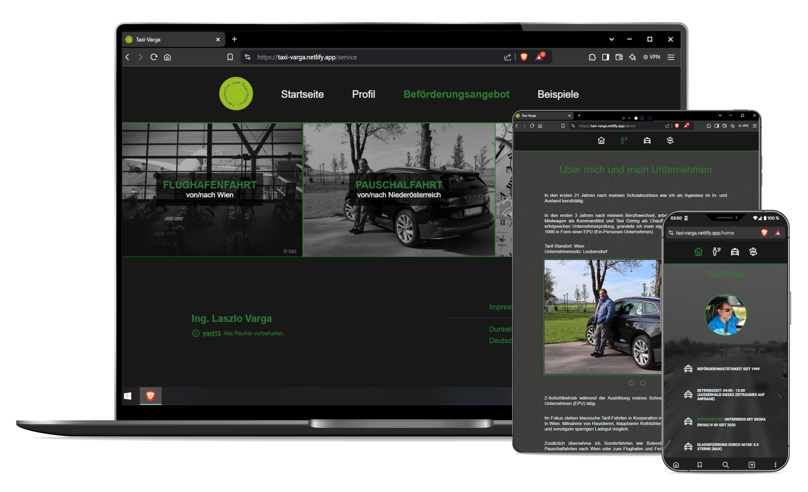
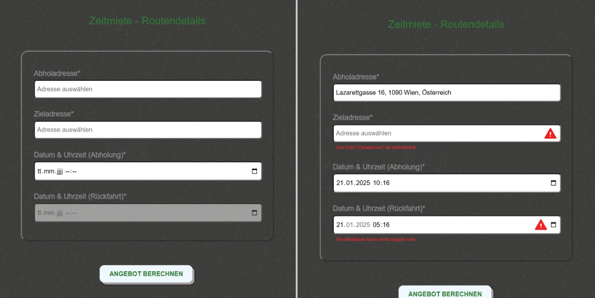
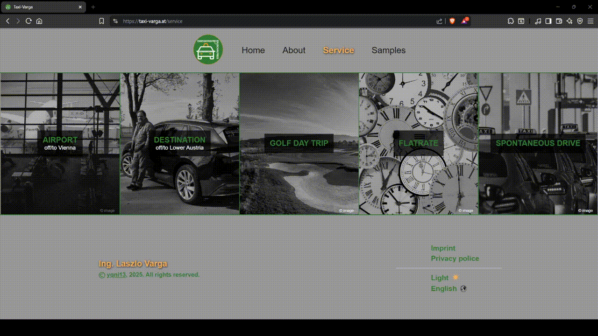
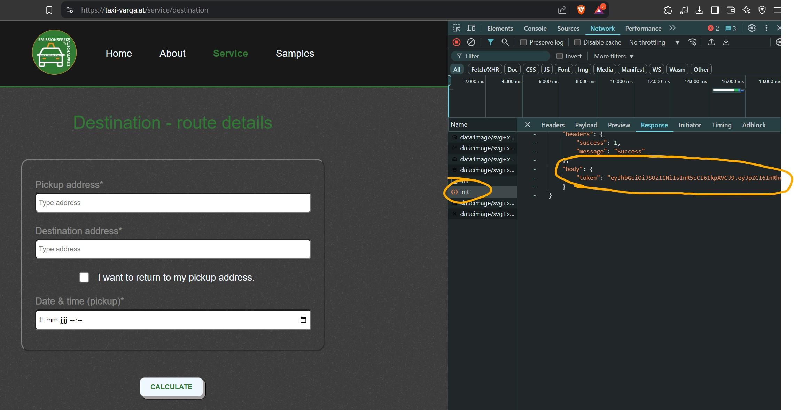
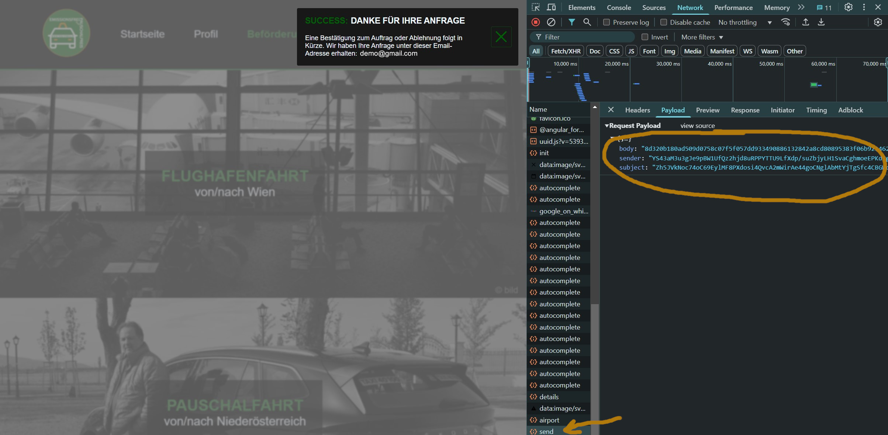

# yqni13 | taxi-varga
$\texttt{\color{teal}{v1.0.3}}$

  

    

### Technology

 

    &nbsp;&nbsp;
    &nbsp;&nbsp;
    &nbsp;&nbsp;

    &nbsp;&nbsp;
    &nbsp;&nbsp;
    &nbsp;&nbsp;

    

    &nbsp;&nbsp;
    &nbsp;&nbsp;

 

### visit the <a href="https://taxi-varga.at">WEBPAGE</a>

 

## How to:

### Start

Get startet with `npm install` (/frontend and /backend) to create necessary modules and run `ng serve` (/frontend) and `node server.js` (/backend) to start your local servers. Navigate to `http://localhost:4200/`. The application will automatically reload if you change any of the source files. To enable the Google API calls, it is necessary to serve the application on https, even in local environment. Therefore, you need to use a self-assigned certificate and set your local environment ready to trust. After some additional changes (backend: server.js must include key/cert and create https-server => see commented lines, frontend: I need to add proxy configuration and adapt my routes in api-services), the frontend part can be served with a command including the key/cert `ng serve --ssl true --ssl-cert <path>/filename.crt --ssl-key <path>/filename.key --open` which will open automatically on `https://localhost:4200/`.
 

### Build & Deploy
The project at /frontend is hosted by <a href="https://app.netlify.com/">Netlify</a> meanwhile /backend is hosted by <a href="https://vercel.com/">Vercel</a>.
 
<b>Note</b>: Netlify does NOT support multi-line environment variables. To use ssh keys, it is neccessary to store the keys as single-line text and convert it back to the preferred format before building the project. Best practice would be to have a script that converts Netlify secrets beforehand or manually add the prepared keys as single-line text and then convert it.
 
Currently public/private keys are converted from single-line secret to multi-line secret in: <a href="./frontend/set-env.ts">set-env.ts</a>
  

## Overview

### $\textsf{\color{teal}Features}$

<dl>
    <dd>:diamond_shape_with_a_dot_inside: Angular v18 standalone with routing + nested routes on id</dd>
    <dd>:repeat: Google Routes/Places API usage in backend</dd>
    <dd>:mag: Custom search-input form component combined with Google Places API</dd>
    <dd>:clipboard: Custom form components (text-, textarea- & select-input)</dd>
    <dd>:wrench: Custom validation Angular/Express-Validator</dd>
    <dd>:lock: asymmetric/hybrid (RSA/AES) encrypted requests</dd>
    <dd>:e-mail: Mail service with node.js & nodemailer for Backend</dd>
    <dd>:signal_strength: Http interception + custom snackbar modal</dd>
    <dd>:new_moon_with_face:/:sun_with_face: Custom color theme (dark/light mode)</dd>
    <dd>:globe_with_meridians: i18n (internationalization) - translate to german or english</dd>
    <dd>:iphone: Responsive design 400px > width < 1800px via flexbox & media queries</dd>
</dl>

 

### $\textsf{\color{teal}Customized form}$

All services take input for calculating the offer by addresses, timestamps and checkboxes/radio buttons as well as customer data like name, email, phone and notes. For full control, custom form components in combination with custom validation are used. The example of figure 2 shows built-in required-validator as well as custom time-related validation to be highlighted via red warning symbol and regarding validation message. Data validated by backend inform user via (custom) snackbar-message of invalid input.

    
    Figure 2

 

### $\textsf{\color{teal}Google API}$

Data from Google, based on the RoutesAPI and PlacesAPI, is used for the calculations and address suggestions/autocompletion. The user can type in the search field for his address and gets a max of 5 addresses listed as a result of the current input. Figure 3 shows, that after every change of the search input, a request is sent providing the listed options in the response. Clicking on an option sends a final request to get all details to the selected address/place, which is necessary to continue the service. If no option is selected, the form will be invalid and the regarding validation message displayed. Google demands to display their logo if a map or place-data (in this case the address options) are used.

    
    Figure 3

 

### $\textsf{\color{teal}Theme + Internationalization}$

The webpage offeres two theme settings: $\textsf{\color{gray}{dark mode}}$ & $\textsf{\color{goldenrod}{light mode}}$. The information on the active setting is stored in the localstorage with dark mode as default setting at the beginning. Additionally, internationalization was implemented (via ngx-translate/core & /http-loader) and at this point 2 languages are available to select (see Figure 4). Dynamic and static texts can be displayed in english or german by choosing the regarding option in the footer. The value gets saved in the localstorage (same as the colour theme) and will stay translated in the selected language. To improve maintanence, the TranslateHttpLoader was customized to join multiple .json files for the same language translation rather than the usual way with only 1 file per language (see custom-translate-loader.ts). 

    
    Figure 4

 

### $\textsf{\color{teal}Security}$

For security reasons, the user automatically starts a service with a background-login process which sends an init request (see figure 5). The payload consists of the service in use and the credential data.Currently both username and password are asymmetrically encrypted => best practice is to hash the password but we dont use a database for hash comparison. The server compares the data to authenticate the validity of the client and generates a random jsonwebtoken with an appropriate expiration time. In the response of figure 5 we can see the generated token that gets stored (currently not cookie, follows with update) and included with each following request to ensure authentication.

    
    Figure 5

 

Hybrid encryption is used for encrypting sensible data like the user input used for sending the emails (name, phone number, message and so forth...). Figure 6 displays the encrypted data in the request, decrypted in the backend to handle logic and again encrypting data for the response. On client side, the webcrypto api support Angular to handle RSA and AES en/decryption and in NodeJS on the backend node-forge comes to use.

    
    Figure 6

 

## Updates
[list of all updates](update_protocol.md)

### $\textsf{last\ update\ 1.0.2\ >>\ {\color{pink}1.0.3}}$

- $\textsf{\color{red}Patch:}$ Adapt price calculation based on business hours.

 

### Aimed objectives for next $\textsf{\color{green}minor}$ update:
<dl>
    <dd>- update Google Places API to Places API (New)</dd>
    <dd>- update email format</dd>
    <dd>- update token handling (refresh token)</dd>
    <dd>- add key navigation</dd>
    <dd>- update logging & exception handling (client side)</dd>
    <dd>- add testing</dd>
</dl>
