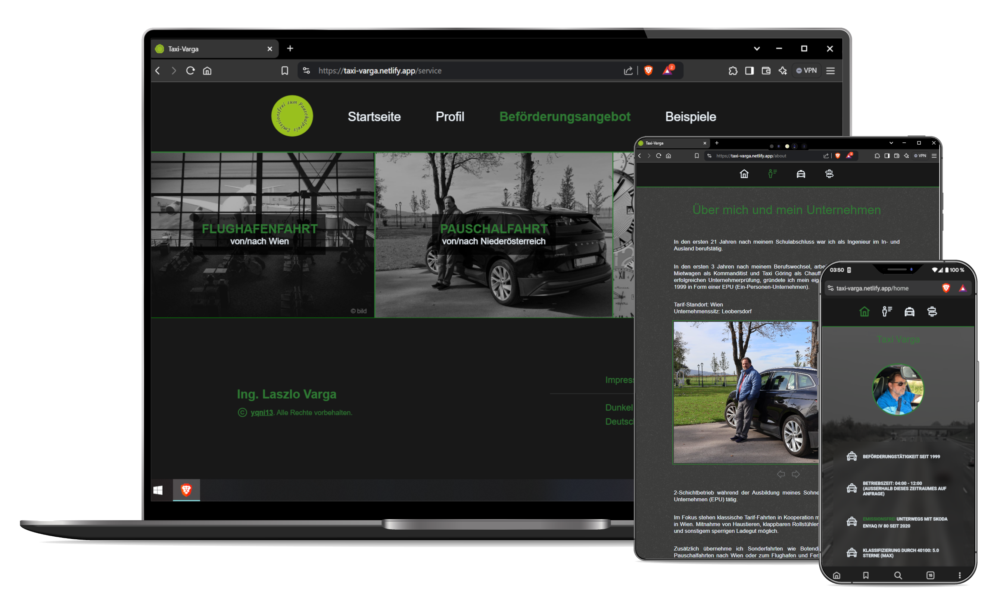
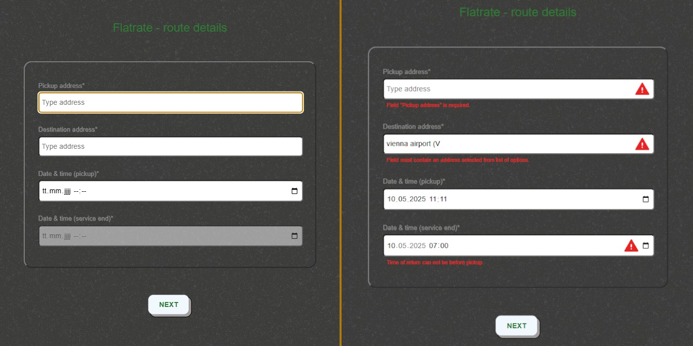
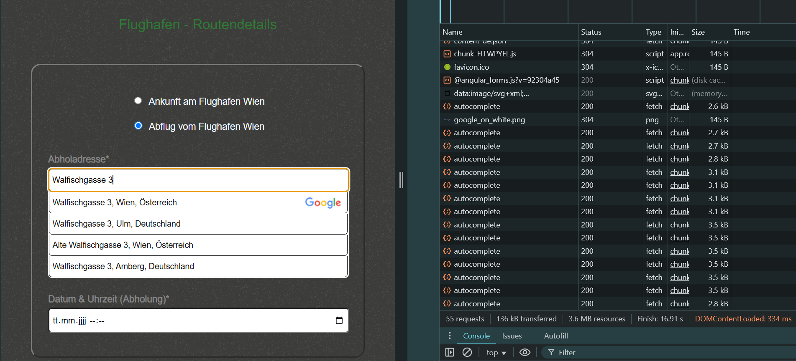
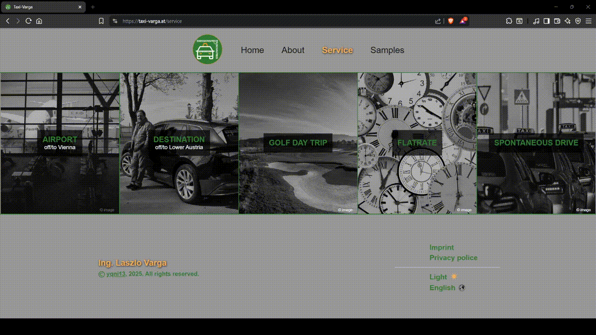
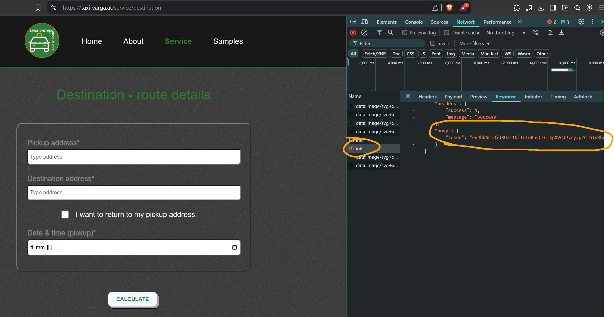
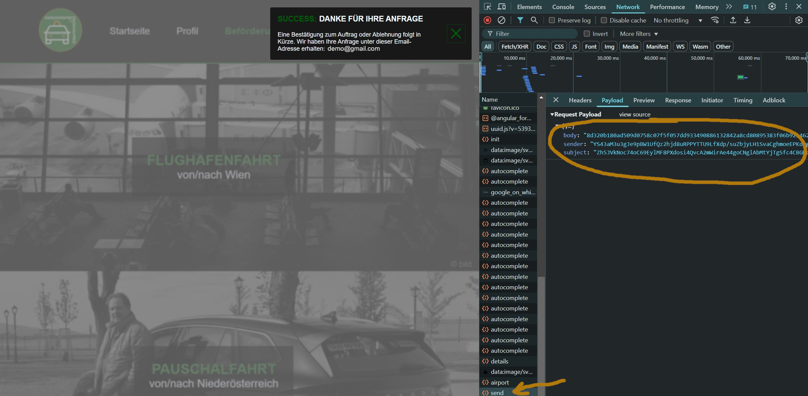
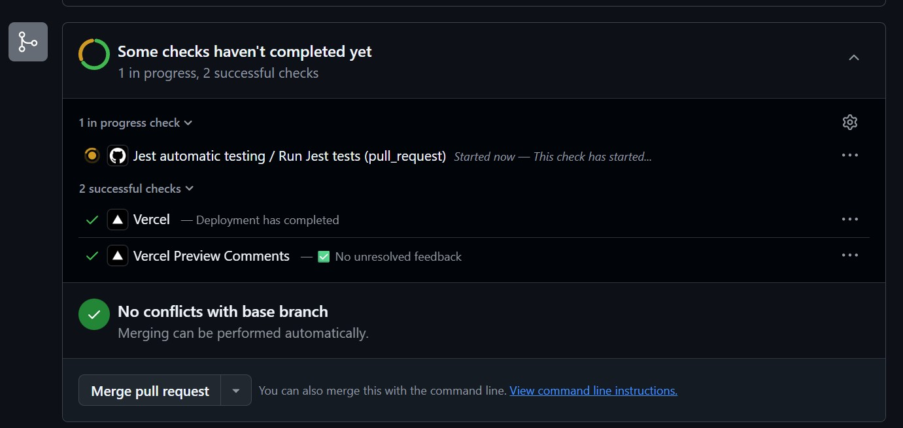

# yqni13 | $\texttt{\color{seagreen}{TAXI-VARGA}}$
### $\textsf{\color{brown}{v1.9.7}}$

<br><br>

<div>
    
</div>


<br>
<div align="center">
    <a href="https://v18.angular.dev/overview"></a>
    <a href="https://nodejs.org/en"></a>
    <a href="https://mapsplatform.google.com/maps-products/?hl=en#places-section"></a>
    <a href="https://rxjs.dev/"></a>
    <a href="https://expressjs.com/"></a>
    <a href="https://mapsplatform.google.com/maps-products/?hl=en#routes-section"></a>
    <a href="https://www.i18next.com/"></a>
    <a href="https://jestjs.io/"></a>
</div>

<br>


### $\textsf{\color{teal}Hosting}$
This project runs live (see link). The frontend-part is hosted by <a href="https://app.netlify.com/">Netlify</a> meanwhile the backend-part is hosted by <a href="https://vercel.com/">Vercel</a>.<br>
For testing purposes one instance runs on env:stag while the live version runs on env:prod.
<br>
### visit the <a href="https://taxi-varga.at">WEBSITE</a>

<br>

## 🪄 $\textsf{\color{salmon}Getting started}$

### $\textsf{\color{teal}Prerequisites}$

- node: v22+
- Google API Key (geocode, places, distanceMatrix)
- Betterstack Telemetry (logging)

<br>

`ALL LISTED COMMANDS ARE DEFINED TO WORK AT LEAST ON POWERSHELL/COMMAND PROMPT.`

<br>

### $\textsf{\color{teal}Local setup}$


Download or clone project

```sh
git clone https://github.com/yqni13/taxi-varga
```

Create new .env file and fill in your credentials/other env data [(see docs)](./CONFIGURATION.md)
<br>Navigate/cd into the root paths (/frontend and /backend) and install dependencies via npm:
```sh
$ npm ci
```
This web project uses Google API calls, which require to run the application on ssl (https) - for each environment (dev/stag/prod). Therefore, running on localhost you need to use a self-assigned certificate and set your local environment ready to trust the certificate and enable ssl connection. See the following [start-via-ssl configurations](README_SSL.md) for help. Additionally, the script to overwrite env data needs to be configured [see set-env.ts](./frontend/set-env.ts) (env:prod) and create local copy [see docs](./CONFIGURATION.md) for local development. Start application (frontend part) in local environment:
```sh
npm run start-local-ssl
```
which will open automatically on `https://localhost:4200/`. To run backend part, use:
```sh
node server.js
```

<br>

## 🧩 $\textsf{\color{salmon}Features}$

| Feature | Description |
|---------|-------------|
| 🪁 Angular | Angular v18 standalone with routing + nested routes on id |
| 🌍 Google API | Google places/routes/geolocation API calculation/visualization |
| ⌨ Input | Customized form components (text/textarea/select) |
| 🔍 Search | Customized search-input form component combined with Google Places API |
| ⚠️ Validation | Customized validation in combination with Angular + Express-Validator |
| 🖼️ Preload | Customized image/video preload |
| 🔐 Encryption | Asymmetric/hybrid (RSA/AES) encrypted requests |
| 📧 Email | Email service with node.js & nodemailer |
| 🗯️ Notification | Customized snackbar + extended translation service |
| 🎨 Themes | Customized theme options (dark/light mode) |
| 📱 Design | Responsive design 400px > width < 1800px supported via flexbox & media queries |

<br>

### $\textsf{\color{teal}Customized form}$

All services take input for calculating the offer by addresses, timestamps and checkboxes/radio buttons as well as customer data like name, email, phone and notes. For full control, custom form components in combination with custom validation are used. The example of figure 2 shows built-in required-validator as well as custom time-related validation to be highlighted via red warning symbol and regarding validation message. Data validated by backend inform user via (custom) snackbar-message of invalid input.

<div align="center">
    
    Figure 2, v1.0.0-beta
</div>

<br>

### $\textsf{\color{teal}Google API}$

Data from Google, based on the `RoutesAPI`, `PlacesAPI` and `MapsAPI (Geocode)`, is used for the calculations and address suggestions/autocompletion. The user can type in the search field for his address and gets a max of 5 addresses listed as a result of the current input. Figure 3 shows, that after every change of the search input, a request is sent providing the listed options in the response. Clicking on an option sends a final request to get all details to the selected address/place, which is necessary to continue the service. If no option is selected, the form will be invalid and the regarding validation message displayed. Google demands to display their logo if a map or place-data (in this case the address options) are used.

<div align="center">
    
    Figure 3, v1.0.0
</div>

<br>

Additionally, the service for spontaneous drives offers a feature to use coordinates via `Geolocation` for determining the starting address and displaying `Google Maps` with the location marked to improve user experience and checking coordinates accuracy (see Figure 4, location used as pickup address). 

<div align="center">
    
    Figure 4, v1.5.2
</div>

<br>

### $\textsf{\color{teal}Theme + Internationalization}$

The webpage offeres two theme settings: $\textsf{\color{gray}{dark mode}}$ & $\textsf{\color{goldenrod}{light mode}}$. The information on the active setting is stored in the localstorage with dark mode as default setting at the beginning. Additionally, internationalization was implemented (via ngx-translate/core & /http-loader) and at this point 2 languages are available to select (see Figure 5). Dynamic and static texts can be displayed in english or german by choosing the regarding option in the footer. The value gets saved in the localstorage (same as the colour theme) and will stay translated in the selected language. To improve maintanence, the TranslateHttpLoader was customized to join multiple .json files for the same language translation rather than the usual way with only 1 file per language [see custom-translate-loader.ts](/frontend/public/assets/i18n/custom-translate-loader.ts).

<div align="center">
    
    Figure 5, v1.5.6
</div>

<br>

### $\textsf{\color{teal}Security}$

For security reasons, the user automatically starts a service with a background-login process which sends an init request (see figure 6). The payload consists of the service in use and the credential data. Currently both username and password are asymmetrically encrypted => best practice is to hash the password but we dont use a database for hash comparison. The server compares the data to authenticate the validity of the client and generates a random jsonwebtoken with an appropriate expiration time. In the response of figure 6 we can see the generated token that gets stored (currently not cookie, follows with update) and included with each following request to ensure authentication.

<div align="center">
    
    Figure 6, v1.0.0
</div>

<br>

Hybrid encryption is used for encrypting sensible data like the user input used for sending the emails (name, phone number, message and so forth...). Figure 7 displays the encrypted data in the request, decrypted in the backend to handle logic and again encrypting data for the response. On client side, the webcrypto api support Angular to handle RSA and AES en/decryption and in NodeJS on the backend node-forge comes to use.

<div align="center">
    
    Figure 7, v1.0.0
</div>

<br>

### $\textsf{\color{teal}Preloading}$

To prevent any delay between building the page and displaying the active assets (images/videos), the `AssetsPreloadService` and `AssetsPreloadGuard` are in use to load everything accordingly. 

Whereas the guard is used within the `*.routes.ts` files to load assets predetermined (see Figure 8, code block), the service can also be used to preload assets/data dynamically or modular:
```sh
this.assetsPreloadService.preloadAssets({
    images?: imagePathArray,
    videos?: videoPathArray
}).finally(() => {
    this.isLoadingFlag = false;
})
```

<div align="center">
    
    Figure 8, v1.2.2
</div>

<br>

## 🔧 $\textsf{\color{salmon}Testing}$

### $\textsf{\color{teal}Jest}$

Added `jest` testing framework to project providing unit tests and integration tests for the `backend`.<br>
Install the packages `@jest/globals`, `@types/jest`, `supertest` additional to `jest`:
```sh
npm install jest @jest/globals @types/jest supertest --save-dev
```
200+ tests exist currently for models, utils, validators and workflows (integration tests) - see [tests](./backend/tests).<br>
Run tests on local device by including setup for dotenv/config to provide environment variables:
```sh
set NODE_MODE=staging && jest --setupFiles dotenv/config
```
or simply save as script command in `package.json` to run `npm test`:
```sh
  "scripts": {
    "start": "node server.js",
    "test": "set NODE_MODE=staging && jest --setupFiles dotenv/config"
  }
```
To automatically check tests before merging feature/development branch further up, a `GitHub Action` is set up, see [main.yml](.github/workflows/main.yml).<br>
Preventing an unwanted merge with unfinished/failed test run, the project is set up to disable merging until all tests have passed (see Figure 9).

<div align="center">
    
    Figure 9, v1.3.1
</div>

<br>

### $\textsf{\color{teal}Angular ESLint}$

Added angular-eslint to project for next step of testing.<br>
Install ESLint global via node package manager:
```sh 
$ npm install -g eslint
```
Install ESLint local for angular project: 

```sh
$ ng add @angular-eslint/schematics
```

Run ESLint to list all current lint errors: 
```sh
$ npm run lint
```
<br>

### $\textsf{\color{teal}Cross-browser testing}$

 |  |  |  |  | 
|:------:|:------:|:------:|:------:|:------:|:------:|
|Firefox | Chrome | Opera  | Edge   | DuckGo | Brave  |
|Yes*    | Yes    | Yes    | Yes    | Yes    | Yes    |

<br>

*This browser has problems with some loading/processing.

<br>

## 📈 $\textsf{\color{salmon}Updates}$
[see changelog for all updates](CHANGELOG.md)

$\textsf{[v1.9.4\ =>\ {\textbf{\color{brown}v1.9.7}]}}$ app
- $\textsf{\color{teal}Addition:}$ Added support component (including routing).
- $\textsf{\color{teal}Addition:}$ Added file-upload service.
- $\textsf{\color{orange}Patch:}$ Updated imprint data + links.

<br>

### Aimed objectives for next $\textsf{\color{green}minor}$ update:
<dl>
    <dd>- update email format</dd>
    <dd>- update token handling (refresh token)</dd>
    <dd>- update logging & exception handling (client side)</dd>
    <dd>- add testing (frontend)</dd>
</dl>
